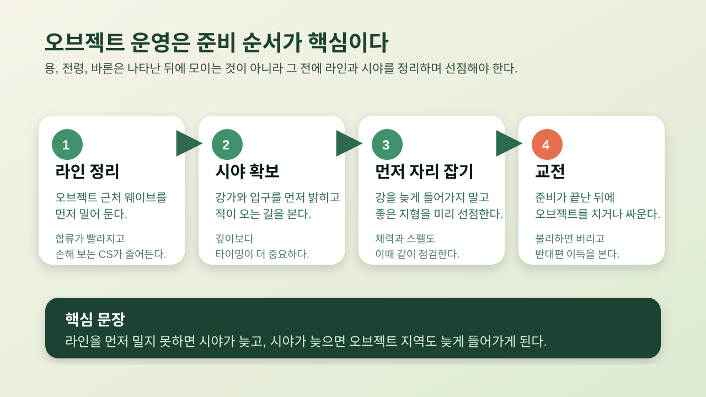
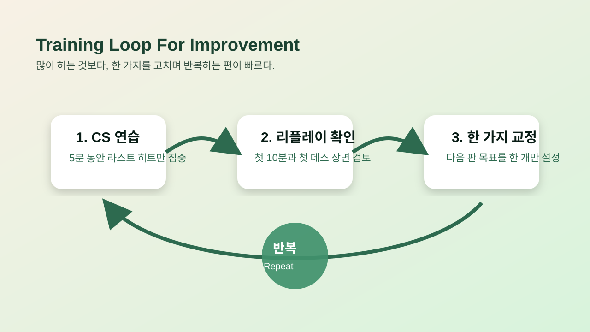
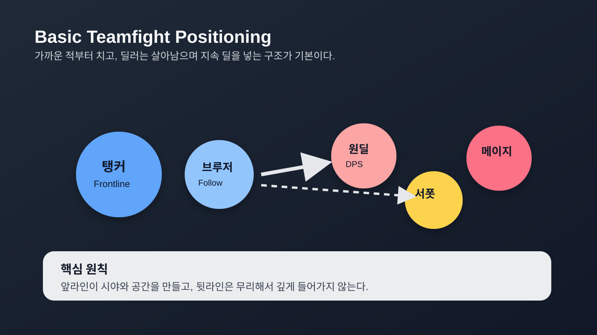

# 리그 오브 레전드 잘하기 위한 실전 가이드

짧고 반복 가능한 기본기에 집중한 발표형 마크다운 초안이다. 모든 페이지는 같은 구조로 정리했다.

## 페이지 1. 실력은 캐리가 아니라 기본기에서 오른다

> 이미지 콘셉트: 소환사 한 명이 미니맵, CS, 와드, 오브젝트 타이머를 동시에 보는 오프닝 커버 이미지

**이미지 포인트**  
화려한 킬 장면보다 `기본기`가 중심에 보이게 만든다.

- 죽지 않는 플레이가 승률을 만든다.
- CS와 웨이브 관리가 골드 차이를 만든다.
- 오브젝트 전에 먼저 움직이는 습관이 중요하다.

## 페이지 2. 오브젝트 운영은 준비 순서가 전부다

**이미지 포인트**  
`라인 정리 → 시야 확보 → 먼저 자리 잡기 → 교전` 순서가 한눈에 보여야 한다.

- 오브젝트 직전에 모이는 팀이 아니라 먼저 준비한 팀이 유리하다.
- 강가 시야는 깊이보다 타이밍이 더 중요하다.
- 불리하면 싸움을 강행하지 말고 반대편 이득을 챙긴다.

## 페이지 3. 챔피언 폭을 줄여야 판단이 빨라진다

> 이미지 콘셉트: 메인 챔피언 2개와 서브 1개만 강조된 챔피언 선택 화면 스타일

**이미지 포인트**  
많은 챔피언보다 `좁은 챔프폭`이 실력 상승에 더 유리하다는 메시지를 준다.

- 메인 2개, 서브 1개 정도로 좁히는 편이 좋다.
- 익숙한 챔피언일수록 딜 계산과 귀환 판단이 빨라진다.
- 기계적 조작보다 운영 판단에 집중할 수 있다.

## 페이지 4. 라인전은 교전보다 손해를 줄이는 싸움이다

**이미지 포인트**  
라인전은 즉흥 싸움이 아니라 `연습 루프`로 좋아진다는 흐름을 보여준다.

- 미니언 수를 먼저 보고 교환한다.
- 상대 핵심 스킬이 빠졌을 때만 짧고 강하게 들어간다.
- 좋은 귀환 타이밍이 라인전 차이를 만든다.

## 페이지 5. 한타는 같은 대상을 치는 팀이 이긴다

**이미지 포인트**  
앞라인과 뒷라인의 거리, 그리고 `가까운 적부터 처리`하는 원칙이 보이게 한다.

- 무리해서 적 딜러만 노리다 구도가 무너지는 경우가 많다.
- 앞라인은 공간을 만들고, 뒷라인은 살아남아 딜을 넣어야 한다.
- 좋은 한타는 개인 플레이보다 포커싱 통일이 먼저다.

## 페이지 6. 포지션별 역할은 다르지만 공통점은 같다

> 이미지 콘셉트: 탑, 정글, 미드, 원딜, 서포터가 각자 다른 위치에 서 있지만 화살표가 하나의 오브젝트로 모이는 장면

**이미지 포인트**  
포지션은 달라도 `합류`, `시야`, `타이밍`이라는 공통 목표를 보여준다.

- 탑은 사이드와 텔레포트 판단이 중요하다.
- 정글과 미드는 시야와 합류 속도가 중요하다.
- 원딜과 서포터는 생존과 포지셔닝이 핵심이다.

## 페이지 7. 멘탈이 무너지면 판단이 먼저 무너진다

> 이미지 콘셉트: 패배 직후 감정적인 채팅 대신 체크리스트를 보는 장면

**이미지 포인트**  
멘탈 관리도 실력이라는 메시지가 차분하게 보이도록 구성한다.

- 2연패하면 쉬는 편이 낫다.
- 채팅보다 복기가 승률에 더 도움이 된다.
- 패배 후에는 내 실수 한 가지부터 기록한다.

## 페이지 8. 빠르게 늘고 싶다면 한 번에 하나만 고친다

> 이미지 콘셉트: `연습 모드 5분 CS → 리플레이 확인 → 다음 판 목표 1개`가 이어지는 체크리스트

**이미지 포인트**  
많이 하기보다 `하나씩 교정하는 루틴`이 핵심이라는 점을 보여준다.

- 첫 판 전 5분 CS 연습으로 손을 푼다.
- 리플레이는 첫 10분과 첫 데스만 봐도 충분하다.
- 다음 판 목표는 반드시 한 개만 정한다.

## 페이지 9. 마지막으로 기억할 세 가지

> 이미지 콘셉트: CS, 와드, 오브젝트 타이머 아이콘 3개가 크게 배치된 엔딩 슬라이드

**이미지 포인트**  
문서 전체 메시지를 세 단어로 압축해서 끝낸다.

- 챔피언 폭 줄이기
- 10분 CS 목표 세우기
- 오브젝트 1분 전부터 움직이기
